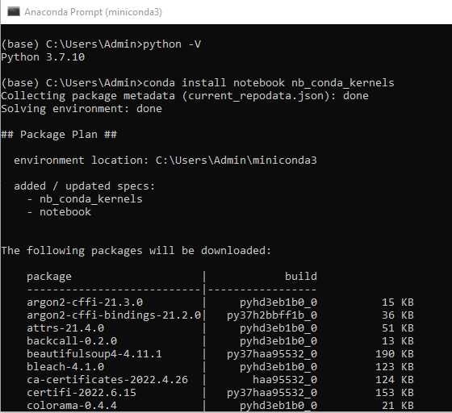
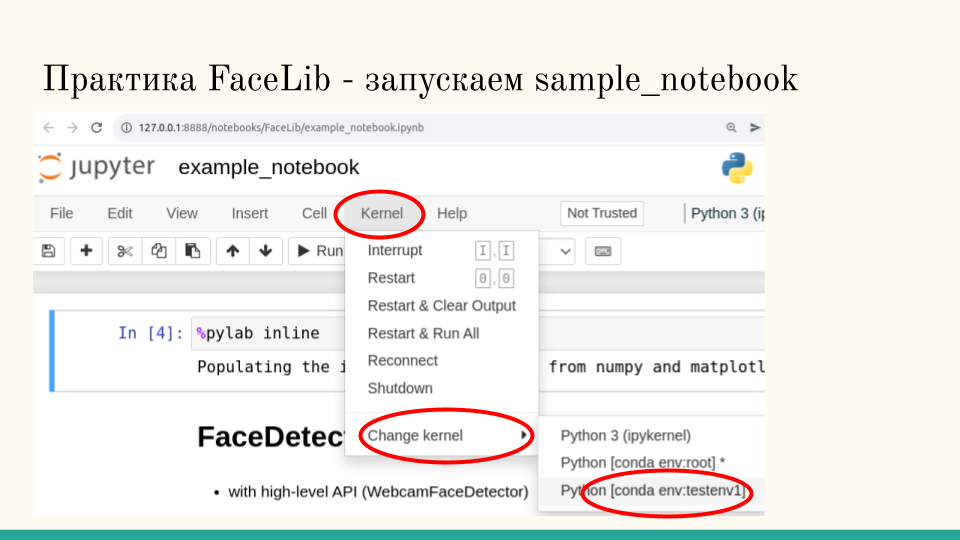

# Занятие 1


## Демонстрации


[@sber_rudalle_xl_bot](http://t.me/sber_rudalle_xl_bot)

[AI да Пушкин](https://ai-pushkin.content.tinkoff.ru/)

[Балабоба - сервис недоступен с марта](https://yandex.ru/lab/yalm)


### Запустить консоль и установить требуемые пакеты


```bash
$ conda install notebook nb_conda_kernels git
```




### Запуск Jupyter

В меню системы выберите Все Программы->Anaconda->Jupyter Notebook

Появляется окно с запуском команды и вкладка в браузере. Для остановки интерпретатора питона надо остановить процесс в окне командой Ctrl-C, потом закрыть вкладку в браузере.


### Запуск тетрадки с примерами FaceLib 

В окне Anaconda Prompt.

Скачайте (склонируйте) репозиторий с кодом FaceLib

```bash
git clone https://github.com/datamove/FaceLib.git
```

Если нет команды git, установите:

```bash
conda install git
```

Создайте среду питона для запуска FaceLib:

```bash
$ conda create -n faceenv ipykernel git
```

Установите требуемые пакеты:

```bash
conda activate faceenv
pip install -r FaceLib\requirements.txt
```

Во вкладке с каталогом найдите FaceLib, зайдите в нее и кликните на `example-notebook.ipynb` 

Смените среду питона на `faceenv`.



Запускайте ячейки по одной.

TODO BSOD из-за драйвера камеры

## Работа с Colab

Откройте ссылку

https://colab.research.google.com/drive/1wGE-046et27oHvNlBNPH07qrEQNE04PQ?usp=sharing

Перед вами интерфейс облачной тетрадки.

Для запуска надо авторизоваться в Google.

В ячейке текст наберите что-то своё.

## Домашнее задание

* Запустите модель Малевич на вашем лаптопе/ПК (в режиме ЦПУ). Для этого создайте новую среду питона, установите требуемые пакеты из файла requrements.txt, смените движок с `cuda` на `cpu`. Поделитесь картинками в группе.
* Посмотрите [репозиторий Сбербанка](https://github.com/ai-forever), что еще вы хотите запустить? Может быть [сгенерировать эмотиконки](https://github.com/ai-forever/ru-dalle/blob/master/Emojich.md)?
