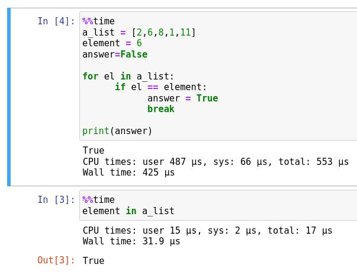

# Занятие 3. Программирование на Python. Алгоритмы.

Алгоритм - последовательность дествий (команд) для достижения определенного результата.


## Алгоритмы поиска

Нахождение элемента в списке или других структурах.

### Линейный поиск

#### Задача о вхождении элемента в список

Задача состоит в том, чтобы определить, содержиться заданный элемент в списке или нет.

В Python вы можете использовать оператор `in`:

```python
a_list = ["a", "c", "e"]
if 'a' in a_list:
   print("Список сожержит 'a')
```

Давайте реализуем этот алгоритм поиска.

Алгоритм проходит по списку, сравнивая каждый элемент списка с заданным элементом. Когда встречается заданный элемент, проход прерывается и печатается `True`. Если такого элемента нет, то после прохода печатается `False`.

Реализуйте алгоритм линейного поиска:

1. Задайте список
1. Задайте элемент для поиска.
1. Задайте переменную для ответа c начальным значением `False`.
1. Реализуйте проход по списку и сравнение текущего элемента с заданным элементом. При совпадении, присвоить переменной для ответа значение `True` и прервать цикл. 
1. Выведите значение переменной для ответа.

Решение:

1-3. 
```python
a_list = [2,6,8,1,11]
element = 6
answer=False
```

4.
```python
for el in a_list:
      if el == element:
            answer = True
            break

print(answer)
```

Проверьте алгоритм для нескольких случаев:

* искомый элемент первый в списке
* искомый элемент последний в списке
* искомый элемент где-то посередине
* искомого элемента нет в списке.

Примените все эти варианты искомого элемента для следующих вариантов списка:
* список состоит из одного элемента
* список пустой (0 элементов)

Проверьте быстродействие вашего алгоритма в сравнении с оператором `in`:



Почему результат сильно отличается, ваши идеи?


#### Задача об определении индекса элемента в списке. 

Эта задача очень похожа на предыдущую, только возвращается индекс (номер) элемента в списке, если он там найден или -1.

Можете воспользоваться следующими функциями:

* len(список) - длина списка (сколько в нем элементов)
* range(n) - сгенерировать список из n элементов от 0 до n-1.

Сравните скорость вашей реализации с методом `a_list.index()`. 

Ответ ниже.

### Бинарный поиск

Применяется к отсортированным спискам.

Работа алгоритма:

* Определяется длина списка
* Вычисляется индек элемента посередине списка (или почти посередине).
* Если он меньше искомого, то продолжаем поиск только среди элементов "справа" от среднего элемента.
* И так пока искомы элемент не найден или список для поиска не станет пустым.

Проверьте алгоритм тестами из линейного поиска.

Сравните скорость работы бинарного алгоритма, линейного и метода `.index()`.

Ответ загуглите.

## Алгоритмы сортировки

### Пузырьковый метод

Суть алгоритма. Сравниваются два соседних элемента списка. Если первый больше второго, то они меняются местами. Повторяем для последующих пар, пока не пройдем весь список. После первого прохода возвращаемся к началу списка и начинаем попарные сравнения 


Задание: Реализуйте алгоритм сортировки пузырьковым методом.

1. Реализуйте обмен двух переменных значениями. 
2. Задайте список со случайными числами. Реализуйте цикл прохода по списку, в теле которого выполняется обмен значениями.
3. Реализуйте условия окончания сортировки (проход бе операция обмена) и вывод отсортированного списка.

Воспользуйтесь фунциями:
* randint() из модуля random для генерации списка из случайных чисел
* len(а) для вычисления длины списка
* range() для генерации списка из последовательных целых чисел с нуля:

```python
#генерируем список их 10 случайных чисел от 0 до 100. 
import random
a_list = [random.randint(0, 100) for x in range(1, 11)]
print(a_list)
```

```python
# длина списка
N = len(a_list)

# итерация по последовательности от 0 до N-1.
for i in range(N-1):
    ...
```

Решение:

```python


```

Ответ внизу!

Сравните быстродействие вашего алгоритма и встроенной функции sorted(), используя прагму %%time в ячейке

Вопрос - сколько проходов делает алгоритм по списку?

О-нотация

# Answers

## Bubble sort

```python
a_list = [50, 4,7,16]

N=len(a_list)

for i in range(N-1):
    for j in range(N-i-1):
        if a_list[j] > a_list[j+1]:
            a_list[j], a_list[j+1] = a_list[j+1], a_list[j]
 
print(a_list)
```

## Linear search

```python
a_list = [2,6,8,1,11]
element = 6
element_index=-1

for i in range(len(a_list)):
      if a_list[i] == element:
            element_index = i
            break

print(element_index)
```

