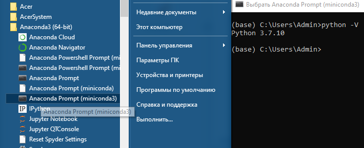
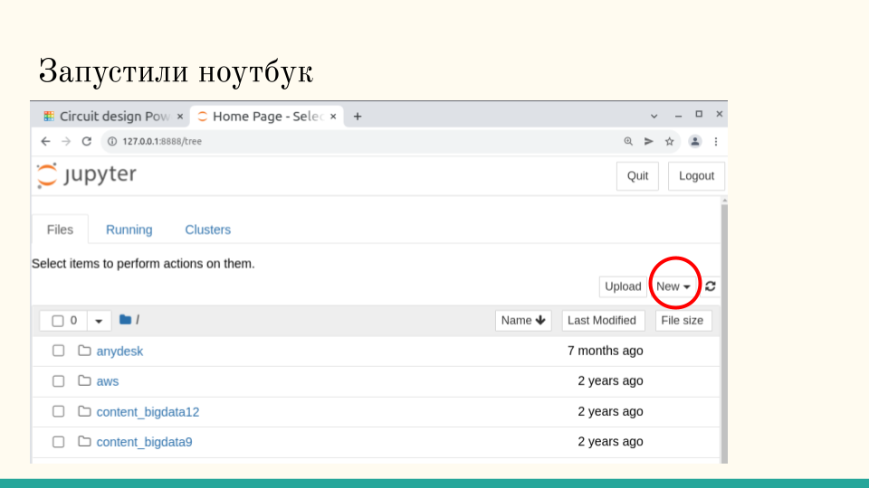
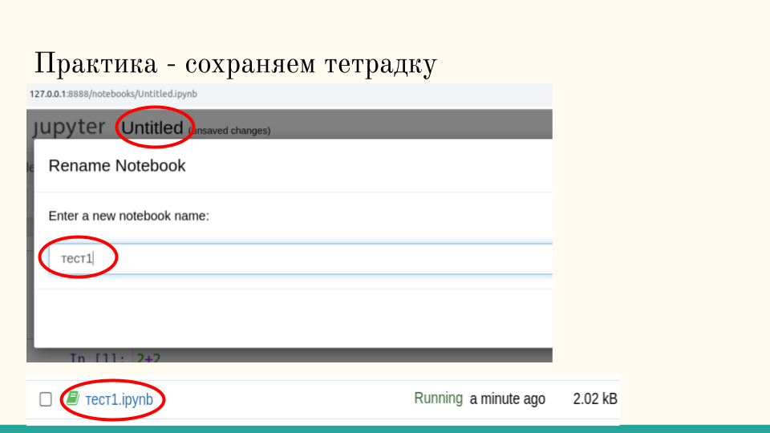
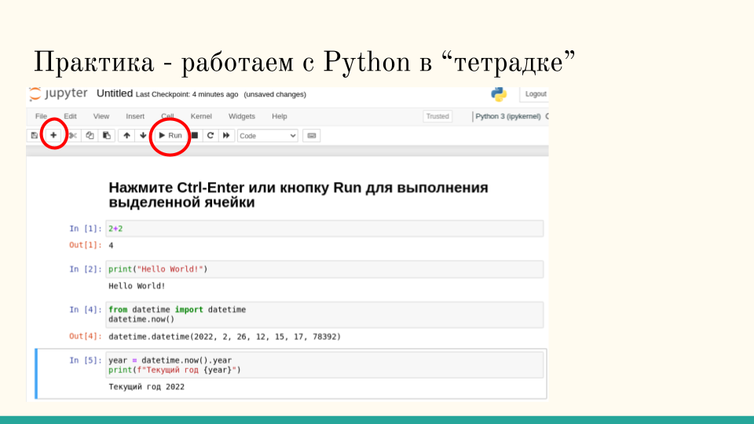
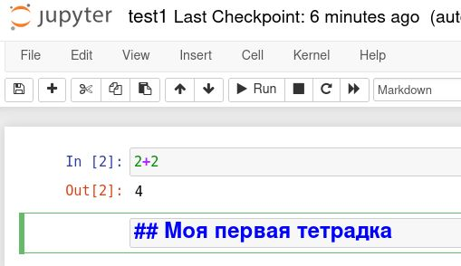

# Занятие 2. Программирование на Python.


## Начало работы с Python

### The Zen of Python

```
    Красивое лучше, чем уродливое.
    Явное лучше, чем неявное.
    Простое лучше, чем сложное.
    Сложное лучше, чем запутанное.
    Плоское лучше, чем вложенное.
    Разреженное лучше, чем плотное.
    Читаемость имеет значение.
    Особые случаи не настолько особые, чтобы нарушать правила.
    При этом практичность важнее безупречности.
    Ошибки никогда не должны замалчиваться.
    Если они не замалчиваются явно.
    Встретив двусмысленность, отбрось искушение угадать.
    Должен существовать один и, желательно, только один очевидный способ сделать это.
    Хотя он поначалу может быть и не очевиден, если вы не голландец [^1].
    Сейчас лучше, чем никогда.
    Хотя никогда зачастую лучше, чем прямо сейчас.
    Если реализацию сложно объяснить — идея плоха.
    Если реализацию легко объяснить — идея, возможно, хороша.
    Пространства имён — отличная штука! Будем делать их больше!
```

### Тетрадка Jupyter.

### Запуск Jupyter

В меню системы выберите Все Программы->Anaconda->Jupyter Notebook

Появляется окно с запуском команды и вкладка в браузере. Для остановки интерпретатора питона надо ост
ановить процесс в окне командой Ctrl-C, потом закрыть вкладку в браузере.




### Новая тетрадка "тетрадке"

В правом внрхнем углу найдите New и выберите Python 3.




Переименуйте ноутбук:




### Работа с тетрадкой

#### Ячейки с кодом

Напишите одну или несколько строчек в ячейке и нажмите Ctrl-Enter или кнопку Run. Для новой ячейки нажмите кнопку +.



Пример: 

```python
2+2
```


### Ячейки с разметкой (markdown).

Выделите пустую ячейку и нажмите на клавиатуре латинскую `m`. Вы сменили тип ячейки - теперь её нельзя запускать, но можно написать там комментарий или заголовок.

В начале строки ячейки напечатайте символы ## и далее какой-то текст. Нажмите Ctrl-Enter. текст отрендерился в заголовок второго уровня.




### Вычисления в ячейке

Самое простое, что можно сделать в интерпретаторе Python без знания синтаксиса языка - просто что-то вычислить. Попробуйте эти выражения, каждое в своей ячейке.


```python
2+2
2*3
3**3
4 + 6 * 7
(4+6)*7
```

Скобки служат для определения приоритета операций.

## Переменные

Переменная - название ячейки памяти, в которой хранится некоторое значение определеного типа. 

```python
a = 2 + 2
a
```

```python
a = 2 + 2
print(a)
```

Вывод с форматированием (f-строки)
```python
a = 2 + 2
print(f"{a}")
```

```python
a = 2
b = a + 2
c = b
print(f"{a} {b} {c}")
```

