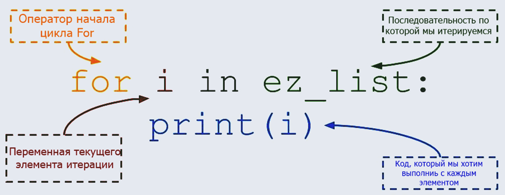
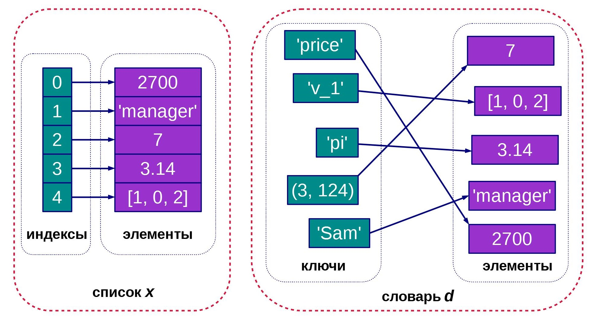

# Типы данных 

### Numbers (числа)

Целые или вещественные.

```python
3.14*2
```

```python
10/3
```

Можно так же использовать инженерную нотацию для записи вещественных чисел. В этой нотации:


Попробуйте сами:

```python
1e4
1e-4
100 + 1e2
```

Целые цичла не имею предела. Там где другие языки ограничивают значение целых чисел примерно  2 147 483 647 для 32-битного представления, у питона нет таких ограничений:

```python
10304005060606700 + 10304005060606700
```

Вещественные числа хранятся с определенной точностью и имеют предел, после которого число становится бесконечностью.

```python
1e400
```

Но это очень большое число, больше чем атомов во вселенной. Вряд ли оно вам пригодится дя чего-то практичного.


### Strings (строки)

Строки - любой набор символов, даже не печатные и не отображаемые (управляющие).

```python
"Hello world!"
```

```python
"Hello world\nс переносом строки!"
```

Увидели `\n`? Это - символ переноса строки. Есть несколько спецсимволов, которые кодируются таким образов - с обратной косой чертой `\`.

Строки хранятся в кодировке Unicode, или UTF-8.

Со строками можно много чего делать.

Можно просто соединять строки ("складывать"):

```python
a = "Hello World"
b = "!"
a + b
```

Взять подстроку:


```python
a = "Hello World!"
a[0:4]
```

Нумерация символов в строках начинается с 0.

Если берется строка с начала, можно опустить 0:

```python
a = "Hello World!"
a[:4]
```

Тоже верно для подстроки до её конца:

```python
a = "Hello World!"
a[6:]
```

А вот заменить подстроку с помощью индексирования не удастся. Следующий код выдаст ошибку:


```python
a = "Hello World!"
a[6:9] = "Вася"
a
```

Однако можно воспользоваться методом replace() без указания индекса подстроки:


```python
a = "Hello World!"
b = "World"
c = "Вася"
a.replace(b,c)
```


Можно убрать пробелы по краям строк (если они там есть):


```python
a = "   Hello World!   "
a.strip()
```

Можно привести строку к верхнему регистру:

```python
a = "   hello world!   "
a.upper()
```

Попробуйте сами применить методы `lower()`, `capitalize()`, `title()`

А еще строку можно разбить на части:

```python
a = "Hello World"
a.split()
```

и с этим мы удачно подошли к спискам 

### Lists (списки) и циклы

Список это упорядоченный набор элементов

```python
a = ['Hello', 'World']
a
```

Список не обязательно состоит из элементов одного типа, хотя на практике чаще всего в списке однотипные элементы.

Обращаться к элементам списка можно так же как и к подстрокам:


```python
a = ['Hello', 'World']
print(a)
print(a[0])
print(a[1:])
```

Можно добавить новый элемент списка:

```python
a.append("!")
a
```
или даже не один элемент, а другой список

```python
b = ['and', 'stuff']
a.extend(b)
a
```

Тоже самое достигается и сложением списков:

```python
a + b
```

#### Проход по списку (итерация) c циклом for

Для прохода по списку в языке предусмотрены циклы. *Тело цикла* выполняется столько раз, сколько элементов в списке, а
 *переменной цикла* `element` присваивается эначение текущего элемента.

```python
ez_list = ['Hello', 'World'] + ['and', 'stuff']

for i in ez_list:
   print(i)
```



Отступ неодходим, причем строки тела цикла все должны быть с одним отступом. Сколько пробелов в отступе не имеет значения. Как называется переменная цикла тоже не имеет значения.

Пример с суммированием элементов списка:


```python
hello_list = [1,2,3,5]

sum = 0 #начальное значение суммы.

for i in hello_list:
   sum = sum + i
   
# Выводим результат
print(sum) 
```

Заметили #? Это комментарий. Питон не пытается интерпретировать текст после # как программу. Можно (нужно) писать о том что делает ваш код.

А еще есть такая штука, которая называется `списковое включение`, или `генератор списка`:

```python
a_list = [1,2,3,4,5]

b_list = [ x*2 for x in a_list ]
```

Второй список будет содержать элементы первого списка, умноженные на 2. Это идиома питона, чтобы заменить короткий цикл одной строкой.

Все знают, что такое идиома?

#### Проход по списку (итерация) c циклом while


```python
n = 0

while n<5:
    n = n + 1
    print(f"В теле цикла: {n}")

print(f"финальное значение {n}")
```

### Dictionaries (словари)

Словарь - это набор пар ключ-значение. Отличие от списка в том, что элементы словаря можно извлечь не по индексу элемента в списке, а по ключу этого элемента. По аналогии со словарем-книгой, где мы ищем описание (перевод) по ключевому слову. Ключи уникальные.




```python
d = {"имя": "Алексей", "возраст": 14, "город": "Москва", "школа": 1}

print(d)
print(d["имя"])
print(f'Привет, {d["имя"]}')
```

Заметили разные кавычки?

#### Проход по словарю (итерация)

```
for key, value in d.items():
   print(f"Ключ {key} значение {value}"
   print(d[key])

Заметили, что порядок элементов такой же, как задавали при создании словаря? Это так в последних версиях питона, но не свойства этого типа данных в целом.
```

А что за новый синтакс с запятой? `key, value`? Это кортеж.

### Tuples (кортежи)

Это упорядоченный набор элементов, который нельзя изменить. Из-за этого с ним мало что можно делать. и мы не будем подробно его рассматривать. 

Для самостоятельного изучения - [Ссылка на тему кортежи в курсе Пеколение Python на stepic.org](https://stepik.org/lesson/443989/step/1?unit=434153).

### Sets (множества)

Неупорядоченный набор элементов, с которым можно делать  операции теории множеств, тоже не будем рассматривать в основной программе.

Для самостоятельного изучения - [Ссылка на тему множества в курсе Пеколение Python на stepic.org](https://stepik.org/lesson/445789/step/1?unit=436050).

### Boolean (логический тип данных) и условные операторы

Как часто вы слышите в споре "Истина где-то посередине"? У компьютера так не бывает. Компьютеры работают с двоичной системой счисления, в которой есть только 0 или 1. Соответственно, у компьютеров бинарная логика - либо 0, либо 1. Единице соответствует истина (True), а нулю - ложь (False).

Применение в Python.

```python
a = 2
b = 4
print(a < b)
print(a > b)
print(a == b)
```

Поиграйте с ">=", "<=", "!="

Проверять условие и что-то делать в зависимости от результата можно с помощью условных операторов.

с дейстивем, если условие выполняется:

```python
if a > b:
  print(f"{a} is greater then {b}")
```

С действием, если условие выполняется и другим дествием, если не выполняется:

```python
if a > b:
  print(f"{a} is greater then {b}")
else:
  print(f"{a} is NOT greater then {b}")
```

С несколькими условиями:

```python
if a > b:
  print(f"{a} is indeed greater then {b}")
elif a < b:
  print(f"{a} is less then {b}")
else: 
  print(f"{a} is equal to {b}")
```

#### Вернемся к циклам

Условные операторы можно применять для выхода из цикла. В примере ниже условие цикла фиксировано - цикл никогда не закончится. А условие окончания мы поместили в тело цикла. При удовлетворении условию, запускается оператор `break` ("сломать"):

```python
n = 0

while True:
    n = n + 1
    print(f"В теле цикла: {n}")
    if n == 5:
        break

print(f"финальное значение {n}")
```

### Справочник по типам данных

https://digitology.tech/docs/python_3/library/stdtypes.html

Гуглите, не стесняйтесь! Обращайте внимание на stackoverflow.com 


