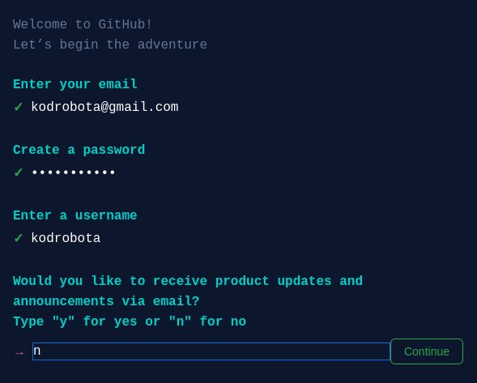
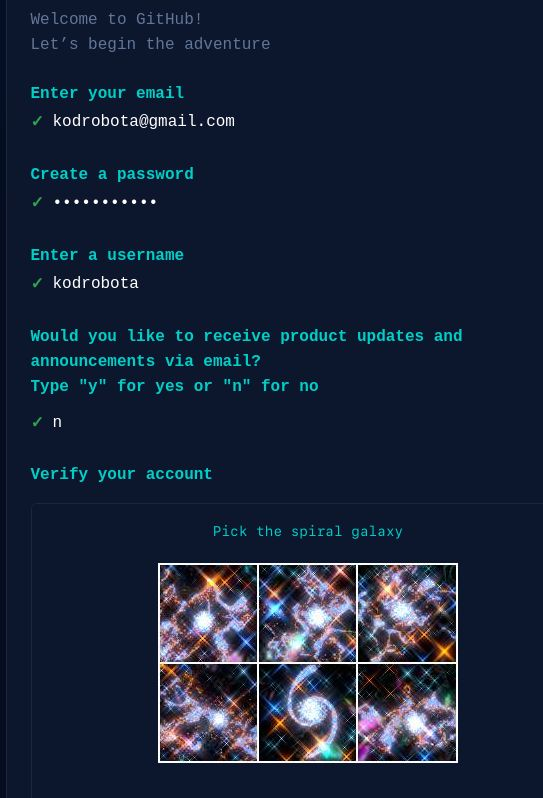
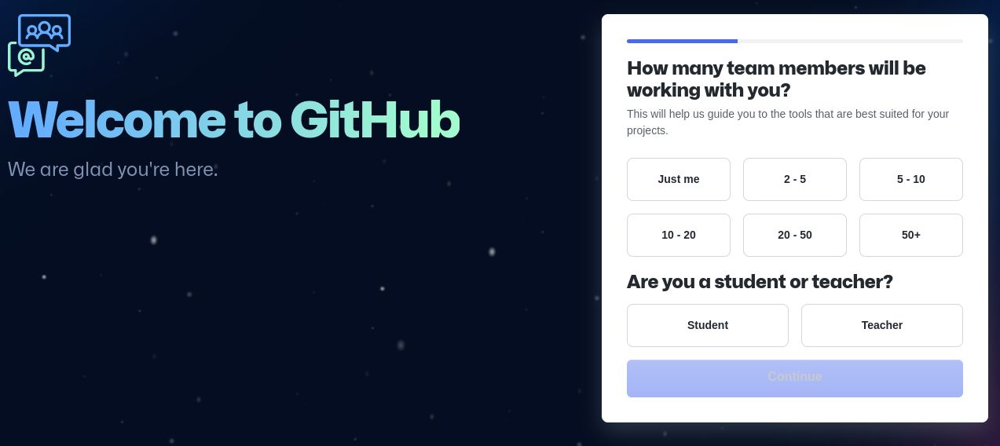
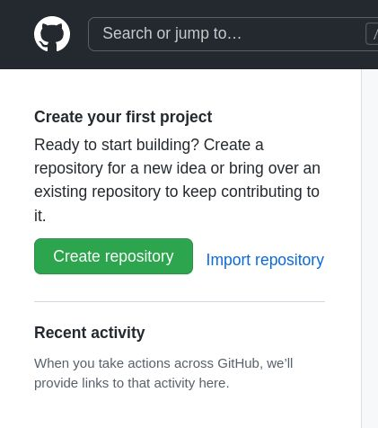
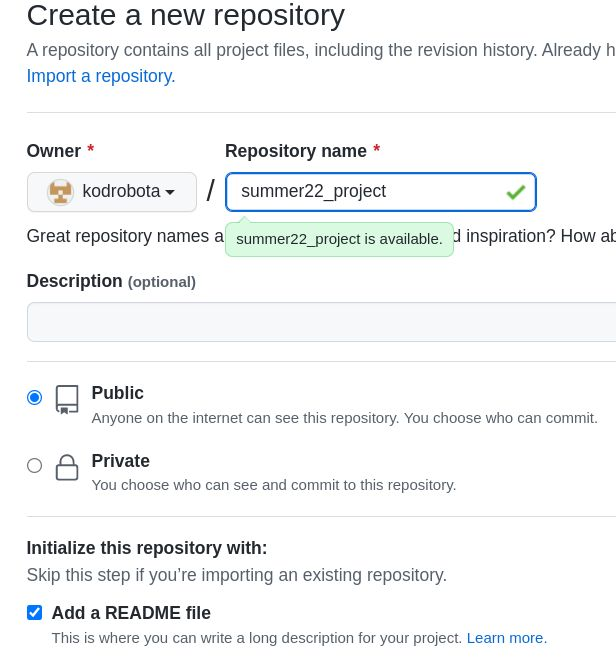
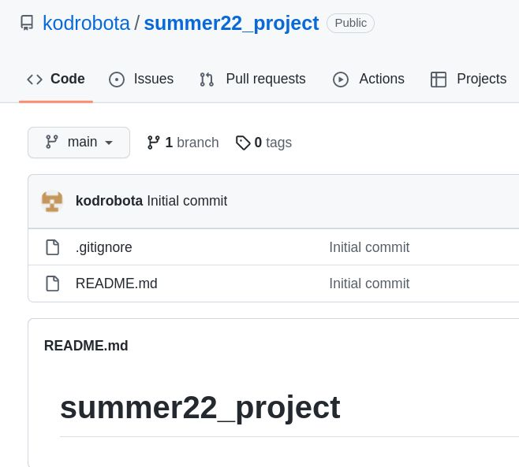
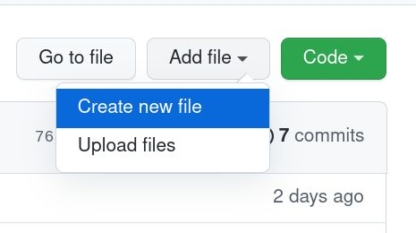
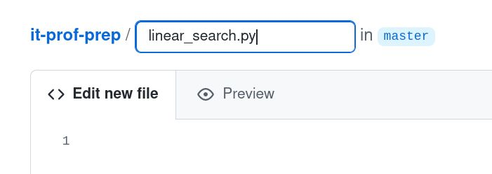
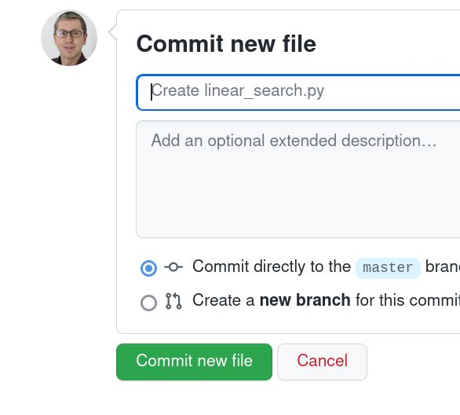

# Занятие 1. Современные средства разработки ПО. Среды разработки, репозитории.

## git - система контроля версий

Заведите себе аккаунт на сайте github.com

На сайте github.com нажмите на Sign Up.

Заполните электронную почту, ник пользователя, придумайте пароль:

Верифицируйте:

Вы сделали это! Выбирайте Just me, Continue.

Пропускаем этот шаг

Выбираем бесплатный план слева

Сходу создаем первый репозиторий, нажимаем create repo:

Настройки репо: название, Public, README.

Готово!

## Работа с языком разметки 

Нажмите на кнопку Raw справа и посмотрите как написана эта страничка.

Вы видите:

* заголовки нескольких уровней: `#`, `##`, `###`.
* список с точками `*`
* выделения с обратными кавычками
* выделения *жирным* и _курсивом_
* Ссылки на другие странички
* Вставка картинок.

## Проект - ваше портфолио на Github.com

### какая-то программа

Нажмите на Add File, create new. 

Назовите ваш файл как-то.

Копи-Вставьте текст программы, и нажмите Commit внизу.

Ваша программа готова! Можно кликнуть на нее и посмотреть ее текст.

### описание в README.md

Нажмите на кнопку редактирования файла README.md

Напишите описание программы, используя язык разметки.

