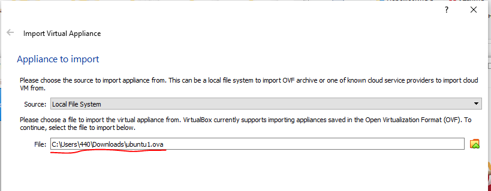
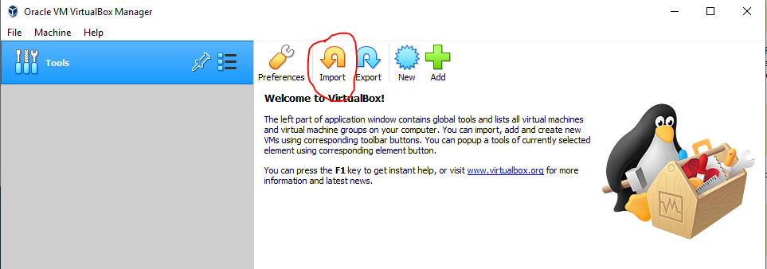
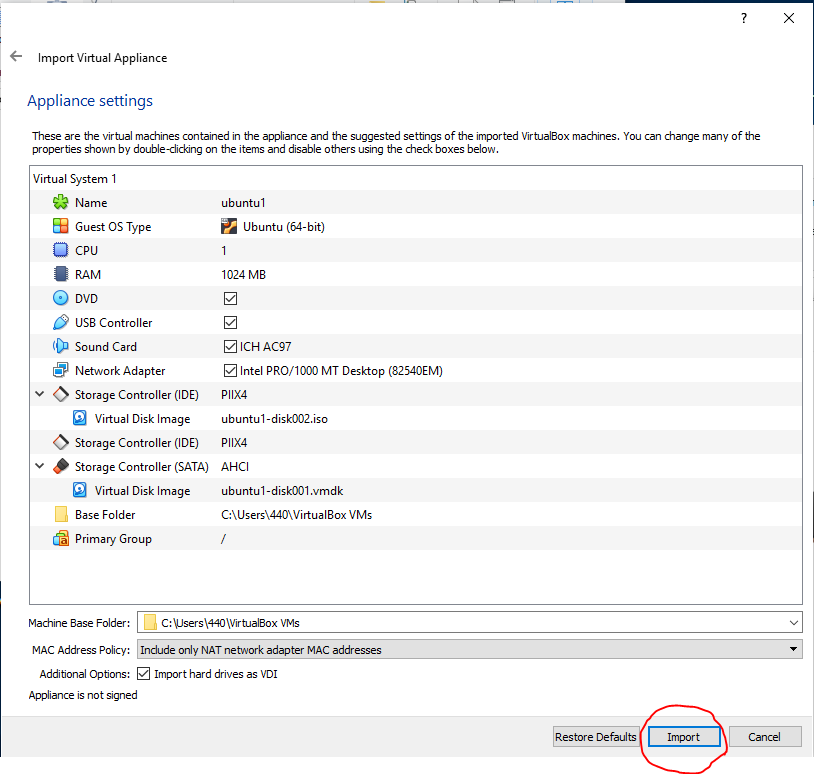

# Занятие 1. Профессия Devops и основы системного администрирования. ОС Linux.

## Установка образа в Virtual Box

Virtual Box - программа для запуска виртуальных машин. Она эмулирует реальное железо.

## Шаг 1

## Шаг 2

## Шаг 3

