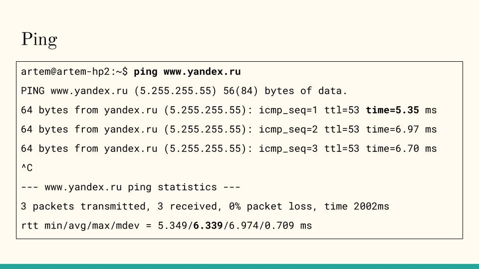
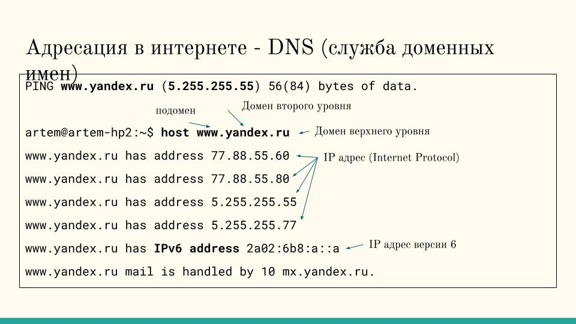

# Работа с Linux. Продолжение.

## Выходим в интернет

Общение между компьютерами по сети идет посредством пакетов сообщений

Сетевой пакет это такое электронное сообщение с адресатом, отправителем и сообщением до 1500 символов

Давайте пошлем маленький тестовый пакет на разные сайты и посмотрим как быстро они откликаются.

`ping www.google.com`

`ping www.yandex.com`

Нажмите Ctrl-C чтоб прервать



## Задание с ping

Посмотрите отклик разных сайтов, которые вы знаете

Посмотрите сайты из разных частей света

* japan.jp
* msu.edu
* www.com.au


## IP-address



## Задание с интернетом

Посмотрите адреса каких-нибудь сайтов в интернете с помощью команды host.

## Браузер в командной строке

* w3m (`sudo apt install w3m w3m-img`)
* lynx (`sudo apt install lynx`)
* links2 (`sudo apt install links2`)

Попробуйте сайты, которые вы часто посещаете


## Поиграем?

## ASCII art

### Banner

`banner Olga`

### Cowsay

```bash
sudo apt install cowsay
cowsay "Hello, Olga"
```

### Преобразовать графический файл (jpeg, png) в символьную картинку:

```bash
sudo apt install jp2a
jp2a --output=ascii.txt --colors input.png
```
### Fortune teller

```bash
sudo apt install fortune
fortune
```

### Cmatrix

```bash
sudo apt install cmatrix
cmatrix
```

### Вырасти дерево

```bash
sudo apt install cbonsai
cbonsai -l
```

## Real stuff

```bash
sudo apt install bsdgames
tetris-bsd
```

