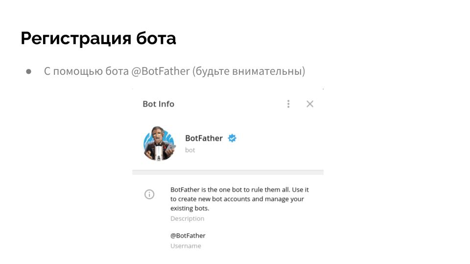
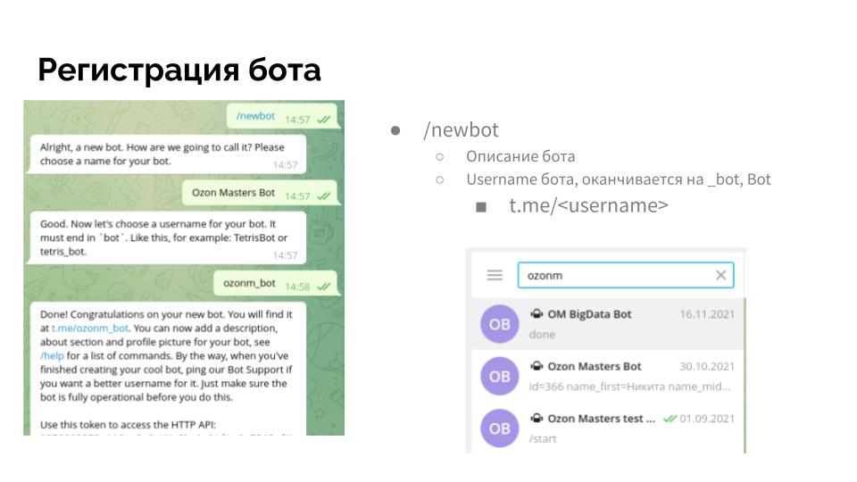

# Telegram bot

## Подготовка

### BotFarther





* /newbot - короткое описание, никнейм_bot. Запишите токен
* или воспользуйтесь моим (удалите пробелы): 5547185149 : AAEwdOAD-pSAvNwcjsl4Km_pwEcwN1c9DdY
* найдите ваш бот в телефоне, нажмите start. 
* или мой бот:  t.me/kr_photo_bot
* Найдите ваш Id
* или возьмите мой (будете мне присылать): 476691449

## Скопируйте токен в файл.

`nano token`

и скопируйте токен туда, сохраните и выйдите, выведите токен:

`cat token`

## getupdates

В терминале, выполните команду curl с этим аргументом, подставляя вместо TOKEN ваш токен. Внимание - оставьте bot на месте.

`curl https://api.telegram.org/botTOKEN/getUpdates`

Если вы получаете "Unauthorized", это означает, что вы ошиблись с токеном где-то. Проверьте букву за буквой, обращая внимание на 0 и О.

Если вы получили "Not found", проверьте, правильно ли вы сформировали URL.

Если вы получили "Ok, result=[]" - все в порядке!

Теперь напишите вашему боту что-то, любое слово. Затем запустите команду выше снова. На этот раз вы получите назад некоторое сообщение, которое содержит что-то вроде "from: {id:2342453454, ..". Это ваш id, который вы используете далее для `chat_id`.

## sendMessage

`curl -X POST --data "chat_id=476691449" --data "text=hello from bot" "https://api.telegram.org/botTOKEN/sendMessage"`

Используйте ваш id вместо моего и ваш токе вместо TOKEN

## sendphoto

Найдите какой-нибудь графический файл в системе с помощью команды `find`:

`find / -name "*.jpg"`

скопируйте его в свою папку:

`cp путь ./newpic.jpg`

Вместо имя подставьте полный путь к одному из найденных файлов. Выделите его мышью и вставьте куда надо.

Запустите для отсылки фото:

`curl https://api.telegram.org/botTOKEN/sendphoto -F chat_id=11112222333 -F photo=@newpic.jpg`

### Пригласите знакомых

Дайте вашим знакомым ссылку на бот в виде `t.me/мой_bot`. Пусть они активируют его, нажав на кнопку Старт. Далее, выполните команду getUpdates и посмотрите их id. Теперь вы можете послать им сообщения или фото.


# Автоматизация

## Исполняемый файл на bash

Запустите редактор `nano bot_send.sh`.

(где bot_send.sh - это имя файла с нашей будущей программой).

Вставьте туда команду отсылки сообщений боту.

Сохраните и выйдите их редактора (Ctlr-X)

```bash
#!/bin/bash

chat_id="476691449"
token=`cat token`

pic=$1

date=`date +'%d%m%Y-%H:%M'`

if curl https://api.telegram.org/bot$token/sendphoto -F chat_id=$chat_id -F photo=@$pic;
then
  echo Success at $date!
else
  echo Error at $date
fi
```


Дайте файлу исполняемый аттрибут:

```bash
chmod +x bot_send.sh
```

запуск:

```bash
./bot_send.sh имя_файла_с_фото
```

Задание

Модифицируйте скрипт так, чтобы он посылал сообщение, если его аргумент - строка, или фото, если его аргумент - картинка.

## запуск скрипта при загрузке

`crontab -e`

редактируем:

`@reboot /bin/bash /home/student/bot_send.sh`

## запуск по расписанию

В 0 минут каждого часа с 9 до 18 каждый день 25-29 июля.

`0 9-18 25-29 7 * /home/student/bot_send.sh`

