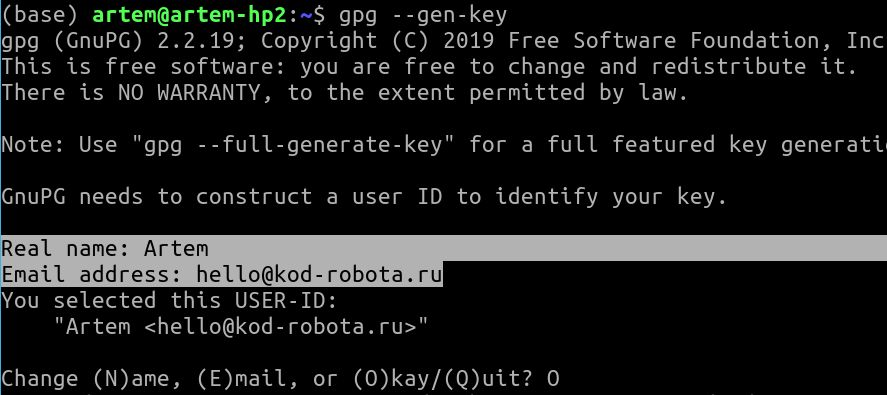
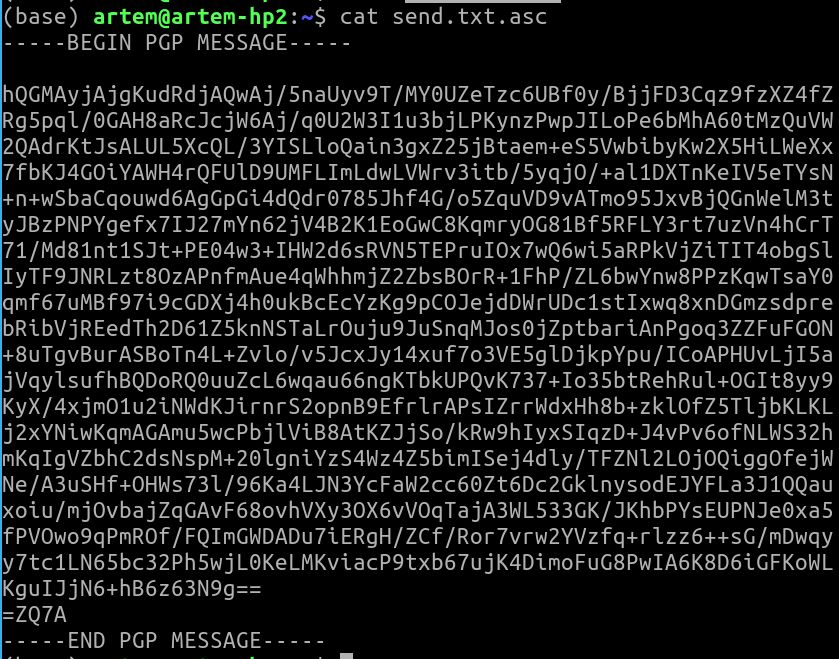
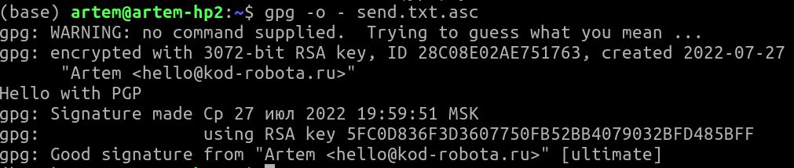

# Шифрование сообщений с помощью GPG

## Установка

```bash
sudo apt-get install gnupg
```

## Генерация ключей

```bash
gpg --gen-key
```

Real Name: введите какие-нбудь имя
email: адрес эл. почты - это уникальный идентификатор вашего ключа

Придумайте пароль для ключа и дважды введите в окошке.




## Зашифровка сообщения

Создайте файл send.txt c каким-нибудь содержимым, например командой echo:

```bash
echo "Hello with PGP" > send.txt
```

Зашифруйте, используя вместо person@email.com тот тмейл, который вы ввели ранее при генерации ключа:


```bash
gpg --encrypt --sign --armor -r person@email.com send.txt
```

В результате создастся файл с зашифрованным сообщением `send.txt.asc`.

Посмотрите его содержимое:




## Расшифровка сообщения.

```bash
gpg -o - send.txt.asc 
```

`-o -` это вывод прямо на экран (по умолчанию - в файл)




# GPG в реальных коммуникациях

## Импорт чужого публичного ключа

`gpg --import name_of_pub_key_file`

## Шифрование сообщения для другого человека

```bash
gpg --encrypt --sign --armor -r person@email.com name_of_file
```

Отошлите ему это сообщение через бот с командой curl, как ранее вы делали.

## Прием сообщений.

Пришлите ваш публичный ключ через ваш бот:

```bash
curl -v -F "chat_id=" -F document=@.pgp/ https://api.telegram.org/bot<TOKEN>/sendDocument
```

Другой человек зашифрует ваше сообщение своим публичным ключем.

Вы получаете сообщения из бота

```bash
curl https://api.telegram.org/bot<TOKEN>/getUpdates
```

Посмотрите, file_id в полученном и сделайте запрос getFile

```bash
curl https://api.telegram.org/bot<token>/getFile?file_id=<file_id>

Этот метод выдает ссылку на скачивание файла, найдт там file_path.

Наконец, скачайте файл:

```bash
curl -O recv.txt.asc https://api.telegram.org/file/bot<token>/<file_path>
```

Это зашифрованный вашим публичным ключем файл.

расшифруйте:

`gpg -o - recv.txt.asc`

Какое сообщение вы получили?


