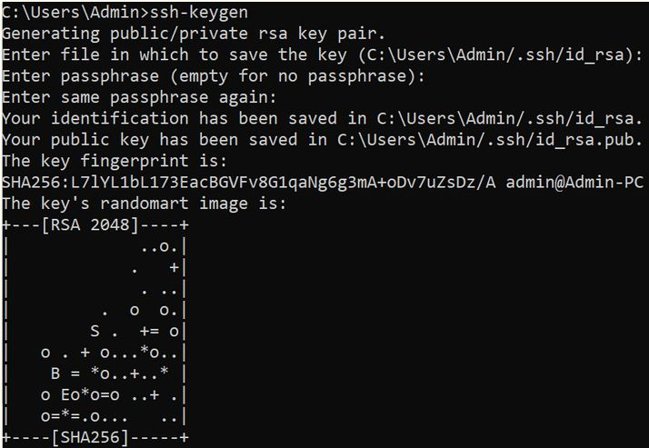

# SSH - Secure SHell

## Логин на сервер с паролем 

В терминале вашей виртуальной машины

```bash
ssh USER@10.55.55.28
```

где вмеcто USER подставьте имя пользователя, выданного вам.

Введите пароль, выданный вам.

### Где сервере хранится пароль

Можете ли вы посмотреть эти файлы? один из них - да, другой - нет - в нем зашифрованные пароли.

* /etc/passwd
* /etc/shadow

### Осмотритесь

Что за система, сколько памяти, какие процессоры, и т д, используя команды lscpu, lsmem, lsblk etc.

### выход обратно на свою виртуалку

`exit`

## Логин с ключами

### Создайте директорию .ssh на сервере.

Залогиньтесь туда с паролем и выполните:

```bash
mkdir .ssh
exit
```

### Генерация ключей

```bash
ssh-keygen
```

примите зачения по умолчанию - нажимайте ввод.



### Посмотрите, как выглядят ключи

```bash
ls -al .ssh
cat .ssg/id_rsa
cat .ssh/id_rsa.pub
```

### скопируйте публичный ключ на сервер

В команде ниже подставьте вместо USER имя пользователя насервере, полученного вами.

```bash
scp .ssh/id_rsa.pub USER@10.55.55.28:.ssh/authorized_keys
```

### попробуйте снова залогиниться


`ssh USER@10.55.55.28`

Сервер не спросит вас пароль - пустит по ключу. Ура!

