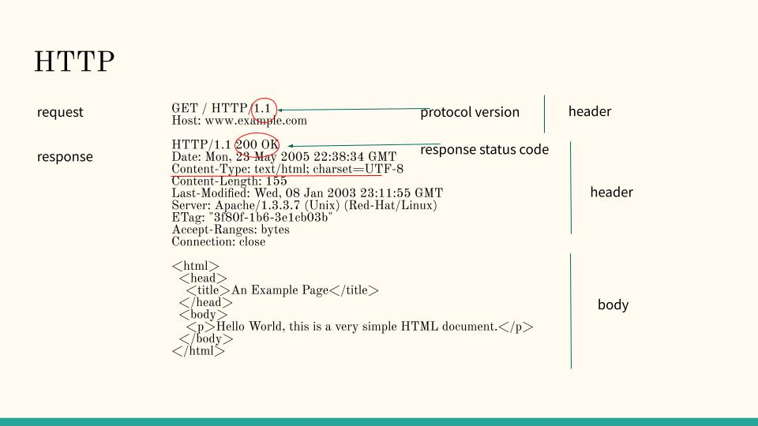
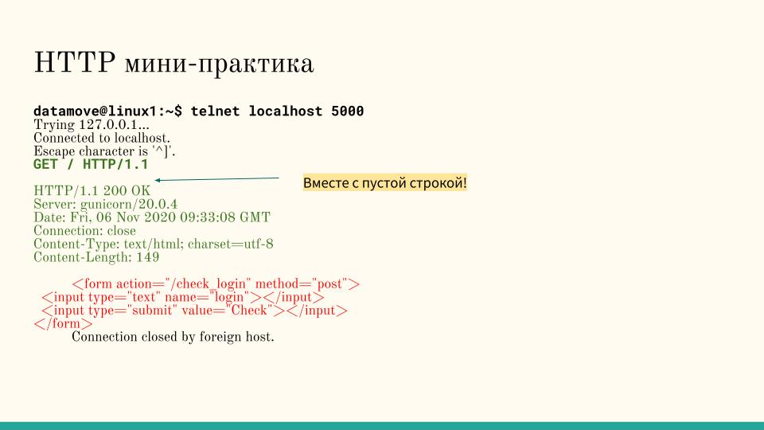

# Flask in virtualenv

В этот тьюториале познакомимся с модулем virtualenv, создадим виртуальную среду, установим туда модуль Flask - фреймворк для создания веб-сайтов на питоне, и запустим небольшой веб-сервер.

Зайдите на сервер 10.55.55.28 под своим акаунтом studentX.

### среда

Виртуальные среду используются, когда вы ведете разработку нескольких программ и у каждой свой набор библиотек, или даже версий питона.

Посмотрите, где в системе "живет" питон:

```bash
which python3
```

Вы увидите путь /usr/bin/python3 или чуть другой.

Создайте виртуальный энвайронмент flaskenv, активируйте его, и установите туда пакет Flask c зависимостям:

```bash
virtualenv flaskenv
source flaskenv/bin/activate
```

Теперь снова проверьте, где питон:


```bash
which python
```

Будет уже другой путь: ./flaskenv/bin/python


Установите пакет flask:

```
pip install flask
```

### код

создайте файл flask-app.py со следующим кодом (запустите редактор nano и копи-вставьте текст программы):

```python
#
# Simple Flask app
#
import os
import pwd

from flask import Flask

port=pwd.getpwnam(os.environ['USER']).pw_uid + 1000
host='0.0.0.0'

app = Flask(__name__)

@app.route('/')
def hello_world():
    return 'Hello world!'

if __name__ == '__main__':
    app.run(debug=True, port=port, host=host)
```

Здесь мы выбраем порт, на котором будет запущен сервер, исходя из ID вашего пользователя в системе + 1000 (прибавление тысячи гарантирует, что мы не попадем в привилигированный диапазон портов только для root). Свой ID можно так же посмотреть командой `id -u`.

Port - по латински дверь. Через двери можно зайти в разные квартиры в доме, а на сервере через порт можно попасть на разные сервисы, которые запущены на сервере. В нашем случае это будут вуб-серверы.

### запуск и тестирование

Запустите:

```bash
python flask-app.py
```

Ваш вывод будет похож на то, что ниже. Это не команда, ее не надо копи-вставлять в 

```
 * Serving Flask app "flask-app" (lazy loading)
 * Environment: production
   WARNING: This is a development server. Do not use it in a production deployment.
   Use a production WSGI server instead.
 * Debug mode: on
 * Running on http://127.0.0.1:2001/ (Press CTRL+C to quit)
 * Restarting with stat
 * Debugger is active!
 * Debugger PIN: 137-096-599
```

Этот сервер доступен на http://10.55.55.28:2001. Адрес 10.55.55.28, а порт у каждого свой - он написан в строке "Running on" выше.

Теперь откройте новый терминал на вашей виртуалке и вызовите там curl с вашим URL (подставляя порт):

```
curl http://10.55.55.28:PORT
```

Вы должны увидеть:

```bash
Hello world!(flaskenv) ubuntu@kod-4:~$ 
```

Вы так же можете зайти браузером на страничку http://http://10.55.55.28:PORT где PORT - ваш порт (см в логе запуска).

Посмотрите в терминал, где запущен ваш сервер:

```
127.0.0.1 - - [14/Oct/2019 09:50:17] "GET / HTTP/1.1" 200 -
127.0.0.1 - - [14/Oct/2019 09:50:17] "GET /favicon.ico HTTP/1.1" 404 -
127.0.0.1 - - [14/Oct/2019 09:51:10] "GET / HTTP/1.1" 200 -
127.0.0.1 - - [14/Oct/2019 09:52:06] "GET / HTTP/1.1" 200 -
```

это ваши запросы в логе.

### HTML

Вместо простого текста можно выводить html:

'nano flask-app.py'

замените `return 'Hello world!'`

на

```
return """<html><body>
<h1>Welcome to nginx!</h1>
</body></html>
"""
```


### Протокол HTTP

HTML - это язык, а HTTP - протокол, т.е. способ взаимодействия клиента и сервера.

Это текстовый протокол, который состоит в следующем:

1. Клиент посылает запрос, который состоит из заголовка и тела запроса.
1. Сервер отвечает - присылает заголовок и тело ответа.



Попробуйте эмулировать программу curl, которая реализует протокол.

Запустите программу `telnet`, которая позволяет отослать любое сообщение на сервер в текстовом виде. Обратите внимание, что у телнета два аргумента - адрес и порт (а не один адрес:порт как у curl).

`telnet ваш_сервер ваш_порт`


 и копи-вставьте туда запрос, вместе с последней пустой строкой.

```
GET / HTTP/1.1
Host: www.example.com

```

Вы должны получить ответ как на слайде




```
HTTP/1.1 200 OK
Date: Mon, 23 May 2005 22:38:34 GMT
Content-Type: text/html; charset=UTF-8
Content-Length: 155
Last-Modified: Wed, 08 Jan 2003 23:11:55 GMT
Server: Apache/1.3.3.7 (Unix) (Red-Hat/Linux)
ETag: "3f80f-1b6-3e1cb03b"
Accept-Ranges: bytes
Connection: close

<html>
  <head>
    <title>An Example Page</title>
  </head>
  <body>
    <p>Hello World, this is a very simple HTML document.</p>
  </body>
</html>


### REST API

Хотя вы можете и приукрасить вашу страничку с помощью HTML, нам наиболее интересно использование сервера через REST API.

Сделайте еще один endpoint, например:

```
from flask import request

@app.route('/do_something/<int:my_param>', methods=['POST'])
def do_something(my_param):
    return(f"PARAMETER {my_param}\nPOST DATA: {request.json}\n")
```

Здесь мы определяем точку входа /do_something для запроса POST, который принимает опциональный параметр-целое число в составе URL. 

Запустите и сделайте вызов следующим образом (передаем объект json в теле запроса):

```
curl -X POST -H "Content-Type: application/json" -d '{"test-key":"test-value"}' http://localhost:5000/do_something/3
```

Вывод:
```
PARAMETER 3
POST DATA: {'test-key': 'test-value'}
```

