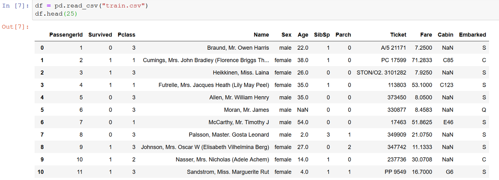

# SQL

## install pandasql

`!pip install pandasql`

## Примеры

```python
data = pd.DataFrame({
   "height":[162,180,170,155],
   "weight":[54.5,90, 50.1, 45.8],
   "sex":[1,0, 1, 0]
})
data
```


### выведем таблицу

```python
import pandasql as ps
ps.sqldf("select * from data")
```

### С условием

```python
ps.sqldf("select * from data where height>170")
```

### Подсчитаем число строк

```python
ps.sqldf("select count(*) from data")
```

### Сколько 


### Агрегаты

```python
ps.sqldf("select avg(height) from data")
ps.sqldf("select avg(height) from data group by sex")
ps.sqldf("select avg(weight) from data")
ps.sqldf("select avg(weight) from data group by sex")
```

Подсчитайте так же max(), min()

## Titanic

Скачайте датасет "Titanic", https://www.kaggle.com/datasets/hesh97/titanicdataset-traincsv, разархивируйте, положите в домашнюю директорию.


считайте файл в ячейке тетрадки:

```python
df = pd.read_csv("train.csv")
df.head(25)
```

Вы увидите подобную картину:

 

Значения колонок:

| Колонка | Значение      | Прмечание                      |
----------|---------------|---------------------------------
| survival |	выжил или нет |	0 = No, 1 = Yes|
| pclass |	Класс билета |	1 = 1st, 2 = 2nd, 3 = 3rd|
| sex |	Пол 	
| Age |	Возраст 	
| sibsp | число братьев или сестер на том же рейсе | 	
| parch |	число родителей или детей на том же рейсе |	
| ticket |	номмер билета 	|
| fare |	цена билета 	|
| cabin |	номер каюты 	|
| embarked | 	В каком порту сел |	C = Cherbourg, Q = Queenstown, S = Southampton


### Разведочный анализ 

Использую SQL, попробуйте применить технику "разведочного анализа" к этому датасету, то есть сделать запросы и вывести что-то интересное.

Например:

* сумма всех проданных билетов
* средний возраст пассажира
* сколько женщин и мужчин было на борту
* отношение выживших ко всем пассажирам первого класса.
* тоже для всех трех классов

### Предсказания

Попробуйте сделать модель логистической регрессии (классификация) и предсказать вероятность гибели пассажира по каким-то числовым признакам, например, возраст, цена билета, класс, и другие. Воспользуйтесь кодом из другой тетрадки

Выберите колонки для обучения:

```python
df_train = df[['fare', 'pclass']]
```

Строим и учим модель:

```python
lr = LogisticRegression()

lr.fit(df_train, df['survival']
```


Подсчитайте точность вашей модели:

```python
from sklearn.metrics import accuracy_score

predicted = lr.predict(df_train)

score =accuracy_score(df['survival'], predicted)
score
```

### Соревнование

Попробуйте обучать модель несколько раз c разными параметрами С:

```python
lr = LogisticRegresion(C=0.1)
# А также попробуйте С=10 и тд.
```
Вычислите точность во всех случаях и скажите, при каком С точность выше?

Поздравляю! Вы - дата сайентист!


